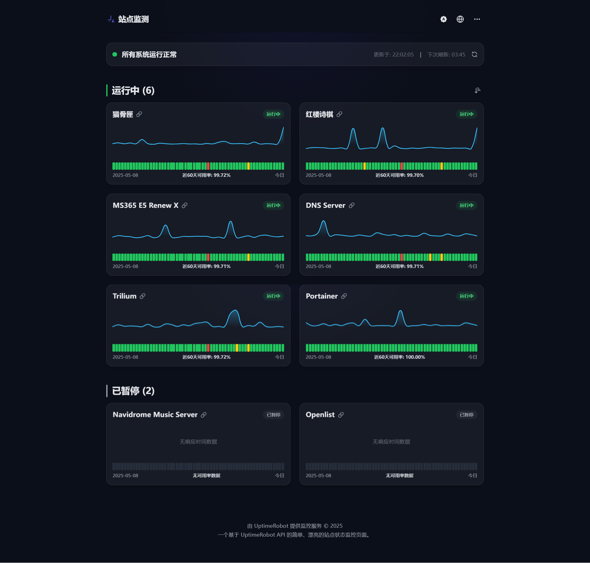

# Uptime Monitor - 一个现代化的站点状态监控页面

这是一个使用 Nuxt 3, Vue 3, TypeScript 和 UptimeRobot API 构建的、功能丰富、美观且快速的站点状态监控面板。它被精心设计，可以轻松地部署在 Cloudflare Pages 平台上。


_（提示：请将此处的截图替换为您自己部署后的页面截图）_

---

## ✨ 主要功能

- **✅ 实时监控**: 通过 UptimeRobot API 拉取并展示站点的实时在线状态和响应延迟。
- **📊 历史数据**: 通过热力图和图表直观展示最近 60 天的可用率和响应时间趋势。
- **📄 详细报告**: 为每个监控项提供独立的详情页，包含详细的图表、统计数据和事件日志。
- **🌐 多语言支持**: 内置简体中文、英语和日语支持，并可通过添加 JSON 文件轻松扩展。
- **🎨 多主题模式**: 支持浅色、深色及跟随系统三种主题模式，提供舒适的视觉体验。
- **🔐 密码保护**: 可通过环境变量开启可选的全站密码保护，确保内容仅对授权用户可见。
- **🎨 精美 UI & 动画**: 拥有精心设计的、与情境匹配的动态错误页面和流畅的 UI 动画。
- **📱 完全响应式**: 在桌面、平板和移动设备上均有优化的布局和良好的浏览体验。

## 🙏 致谢

本项目的许多功能和设计灵感，来源于优秀的开源项目 [imsyy/site-status](https://github.com/imsyy/site-status)。在此向原作者 [imsyy](https://github.com/imsyy) 表示诚挚的感谢！

## 🛠️ 技术栈

- **框架**: [Nuxt 3](https://nuxt.com/)
- **视图层**: [Vue 3](https://vuejs.org/)
- **语言**: [TypeScript](https://www.typescriptlang.org/)
- **CSS 框架**: [Tailwind CSS](https://tailwindcss.com/)
- **国际化**: [@nuxtjs/i18n](https://i18n.nuxtjs.org/)
- **图表**: [Chart.js](https://www.chartjs.org/)
- **数据源**: [UptimeRobot API](https://uptimerobot.com/api/)

## 🚀 本地开发

想在您自己的电脑上运行这个项目吗？请遵循以下步骤：

1.  **克隆仓库**
    ```bash
    git clone https://github.com/maoguxia/uptime-monitor-gemini.git
    cd uptime-monitor-gemini
    ```

2.  **安装依赖**
    ```bash
    npm install
    ```

3.  **配置环境变量**
    复制 `.env.example` 文件并重命名为 `.env`。
    ```bash
    cp .env.example .env
    ```
    然后，编辑 `.env` 文件，填入您的 UptimeRobot **只读 API 密钥** 和您想设置的站点密码。

4.  **启动开发服务器**
    ```bash
    npm run dev
    ```
    现在，在浏览器中打开 `http://localhost:3000` 即可访问。

## ☁️ 部署到 Cloudflare Pages

将这个项目部署到 Cloudflare Pages 非常简单，并且可以享受免费的全球 CDN 加速。

1.  **将您的代码推送到 GitHub/GitLab**
    将您本地的项目文件夹初始化为一个 Git 仓库，并将其推送到您自己的一个新的 GitHub 或 GitLab 仓库中。

2.  **在 Cloudflare 中创建项目**
    - 登录到您的 Cloudflare 账户。
    - 前往 **Workers & Pages** > **Create application** > **Pages** > **Connect to Git**。
    - 选择您刚刚创建的仓库并授权。

3.  **配置构建设置**
    在设置页面，Cloudflare 通常会自动检测到 Nuxt。请确保您的配置如下：
    - **Build command**: `npm run generate`
    - **Build output directory**: `dist` **<-- (重要更新！)**
    - **Root directory**: `/` (保持默认)

4.  **添加环境变量（最重要的一步！）**
    前往项目的 **Settings** > **Environment variables** 页面，添加以下变量：

    | 变量名                        | 值                                  | 备注                                     |
    | ----------------------------- | ----------------------------------- | ---------------------------------------- |
    | `NUXT_UPTIME_ROBOT_API_KEY`     | `urxxxxxx-xxxxxxxxxxxxxxxx`         | **必需**。您的 UptimeRobot API 密钥。      |
    | `NUXT_SITE_PASSWORD_PROTECT`  | `true` 或 `false`                   | **可选**。设为 `true` 以开启密码保护。       |
    | `NUXT_SITE_PASSWORD`          | `YourSecretPassword`                | **可选**。如果您开启了保护，这是访问密码。 |

5.  **保存并部署**
    点击 "Save and Deploy"。Cloudflare 将会自动拉取您的代码、构建项目并将其部署到全球网络。几分钟后，您的站点监控页面就上线了！

## ⭐ 特别致谢

> 这个项目是一次人与 AI 之间充满创造力的合作。
>
> 项目的所有核心功能、UI 设计、组件架构和多语言实现，均在用户的清晰指导和持续反馈下，由 **Gemini 2.5 Pro** 协助生成。
>
> 这次合作证明了，在富有远见的人类创造者和强大的 AI 工具之间，可以构建出多么美妙和完整的应用程序。

## 📄 许可证

本项目采用 [MIT License](https://github.com/maoguxia/uptime-monitor-gemini/blob/main/LICENSE) 开源。